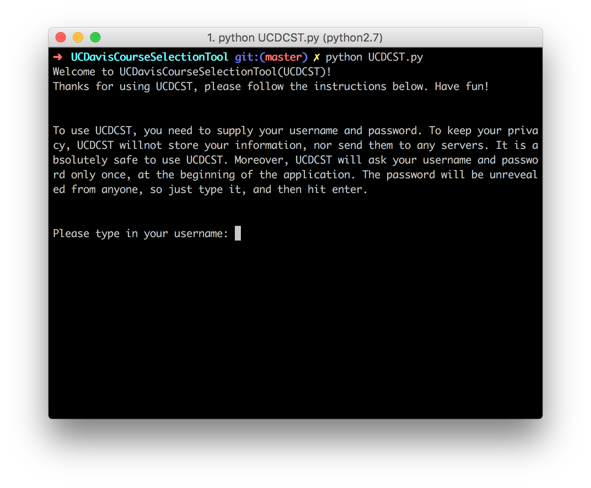

This is UCDavisCourseSelectionTool (*UCDCST*), which is designed for the purpose of fast selecting, dropping and see information from the sisweb system.

It is secure, UCDCST will not store nor send the username and the password; In fact, when you are typing in password, it will be hidden from anyone, including you.

Change Log:

v1.0: Initial commit, features of basic selecting and searching

